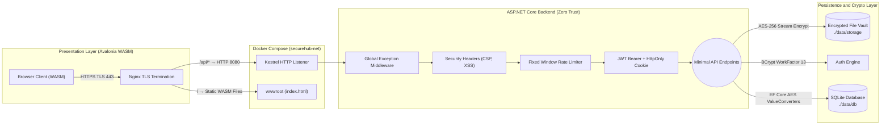
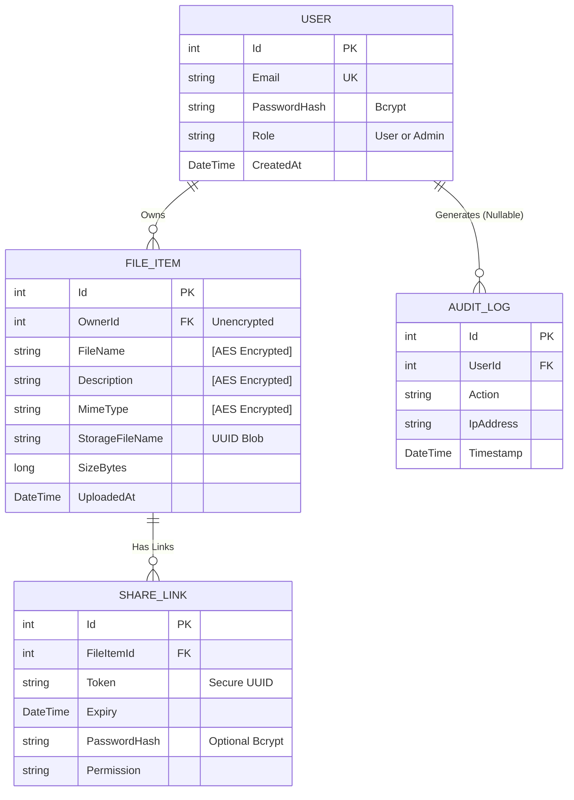

# 🛡️ SecureHub Vault

> **INFO8373 - Cybersecurity for Software Development (Final Project)**
> A zero-trust, Dropbox-like file sharing application demonstrating end-to-end security across .NET 10 Minimal APIs and Avalonia UI (Browser WASM).

---

## 🏗️ System Architecture



## 🗄️ Entity Relationship Diagram (ERD)

The database incorporates AES-256 transparent encryption on field-level mappings, preventing offline storage extraction.



## 🛠️ Technology Stack

| Layer | Technology |
|-------|-----------|
| **Backend** | .NET 10 ASP.NET Core Minimal APIs |
| **Frontend** | Avalonia UI 12.0 (Browser WASM) |
| **Database** | SQLite + Entity Framework Core 10 |
| **Cryptography** | AES-256-GCM, BCrypt.Net-Next |
| **Containerization** | Docker Compose + Nginx (TLS Termination) |
| **Testing** | xUnit, Moq, FluentAssertions, WebApplicationFactory |

## 🔐 Core Security Features

1. **Authentication & Identity**: JWT bearer tokens via HttpOnly cookies. BCrypt with cost-factor 13 for password hashing.
2. **Access Control (IDOR)**: RBAC separating `Admin` and `User`. Server-side ownership checks on every file operation.
3. **Data Protection In-Transit**: Nginx TLS termination with self-signed certificate. HTTP → HTTPS 301 redirect. HSTS header enforced.
4. **Data Protection At-Rest**: AES-256 server-side encryption for uploaded files. Database fields encrypted via EF Core `ValueConverters`. Physical files renamed to UUID.
5. **Brute-Force Defense**: Fixed Window Rate Limiting (5 req/min) on `/api/auth/login`.
6. **Privacy & GDPR**: `DELETE /api/users/me` cascade-deletes account, files, and share links with password confirmation.
7. **System Hardening**: `GlobalExceptionHandlerMiddleware` (no stack traces to client), Security Headers (`X-Content-Type-Options`, `X-Frame-Options`, `CSP`), zero NuGet vulnerabilities.

## 🚀 How to Run

### Option A: Docker Compose (Recommended)

> **Prerequisites**: [Docker Desktop](https://www.docker.com/products/docker-desktop/) only. No .NET SDK required.

```bash
cd SecureHub
docker compose up --build

or

docker compose build
docker compose up -d
```

Open browser: **https://localhost** (accept self-signed certificate warning)

| Credential | Value |
|-----------|-------|
| Admin Email | `admin@securehub.local` |
| Admin Password | `AdminSecur3#1024!` |

```bash
# Stop
docker compose down

# Stop and wipe all data
docker compose down -v
```

**Data Directories** (bind-mounted to host):
| Host Path | Container Path | Contents |
|-----------|---------------|----------|
| `./data/db/` | `/app/Data` | SQLite database |
| `./data/storage/` | `/app/VaultStorage` | AES-256 encrypted files |

---

### Option B: Local Development (Requires .NET 10 SDK)

#### 1. Environment Setup

```bash
cd SecureHub.Api
cp .env.example .env
# Edit .env: replace <INSERT...> placeholders with real values
```

#### 2. Start API Backend

```bash
cd SecureHub.Api
dotnet run
```

#### 3. Start Browser Client

```bash
# One-time: install WASM workload
dotnet workload install wasm-tools

cd SecureHub.Client/SecureHub.Client.Browser
dotnet run
```

---

### 🧪 Security Test Suite

```bash
dotnet test SecureHub.Tests/SecureHub.Tests.csproj
```

16 integration test vectors covering: AES crypto bounds, JWT IDOR blockades, brute-force rate limiting, and FluentValidation payload rejection.

## 📁 Project Structure

```
SecureHub/
├── SecureHub.Api/              # .NET 10 Minimal API Backend
│   ├── Endpoints/              # Auth, File, Share, User, Admin endpoints
│   ├── Middleware/              # Exception handler, Security headers, Audit log
│   ├── Security/               # AES encryption, Password hasher, JWT helpers
│   ├── Data/                   # EF Core DbContext + Migrations
│   └── .env.example            # Template for environment secrets
├── SecureHub.Client/           # Avalonia UI Frontend
│   ├── SecureHub.Client/       # Shared ViewModels, Views, Services
│   └── SecureHub.Client.Browser/  # WASM entry point
├── SecureHub.Tests/            # xUnit integration test suite
├── docker-compose.yml          # One-command deployment
├── Dockerfile.api              # Multi-stage API build (non-root user)
├── Dockerfile.browser          # WASM build + Nginx TLS
├── nginx.conf                  # Reverse proxy + HTTPS + HSTS
└── data/                       # Persistent storage (git-ignored)
    ├── db/                     # SQLite database files
    └── storage/                # Encrypted vault files
```
