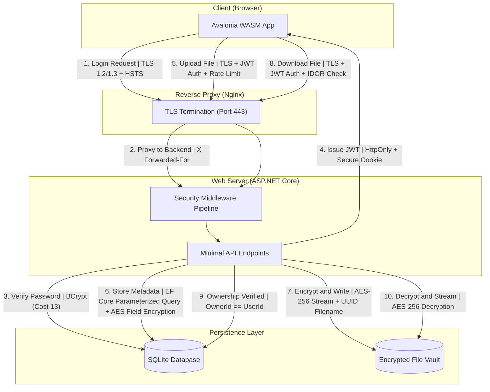

# INFO 8373 - Cybersecurity for Software Development
## Final Project Report: Secure File Sharing & Collaboration Hub

**Team Members:** 

---

## PHASE 1: Project Setup & Threat Modeling

### Task 1.1: Technology Stack Selection
**Language/Runtime:** C# / .NET 10  
**Web Framework:** ASP.NET Core Minimal APIs  
**Client Framework:** Avalonia UI 12.0 (Browser WASM)  
**Database:** SQLite / Entity Framework Core (EF Core)  
**File Storage:** Local File System (`VaultStorage` isolated directory)  
**Containerization:** Docker Compose + Nginx (TLS Termination)  

**Justification:**  
The .NET 10 framework was selected because of its hardened security features. ASP.NET Core Minimal APIs enforce strict routing and binding, minimizing attack surfaces. EF Core automatically uses parameterized queries to entirely neutralize SQL Injection (SQLi) attacks. We chose Avalonia UI compiled to WebAssembly (WASM) for the client, enabling cross-platform browser access while maintaining a compiled C# codebase that is inherently resistant to DOM-based XSS (no direct DOM manipulation). Authentication leverages JWT tokens via HttpOnly secure cookies, neutralizing standard token theft via JavaScript.

### Task 1.2: STRIDE Threat Model

| Threat Type | How could an attacker exploit this? | Defense Mechanism Implemented |
|---|---|---|
| **Spoofing** | Attacker impersonates a legitimate user by stealing a session token or forging a JWT. | HttpOnly secure cookies prevent JavaScript access to JWTs. BCrypt cost-factor 13 resists offline cracking. |
| **Tampering** | Man-in-the-Middle (MitM) modifies uploaded files or sniffs passwords in transit. | Enforced TLS/HTTPS via Nginx. HSTS header prevents SSL downgrade. Files encrypted at rest using AES-256. |
| **Repudiation** | User uploads malware then denies doing it, or claims they didn't delete a file. | `AuditLogMiddleware` captures UserId, IP address, action, and timestamp for every API request. |
| **Information Disclosure** | An attacker guesses the URL to someone else's uploaded file, or reads the database offline. | Files renamed to random UUIDs, stored outside web root. DB fields encrypted with AES ValueConverters. |
| **Denial of Service (DoS)** | Attacker spams the login endpoint or uploads massive files to exhaust disk space. | Fixed Window Rate Limiter: 5 req/min on `/api/auth/login`. Max upload size: 10MB (app) + 15MB (Nginx). |
| **Elevation of Privilege** | Normal user tries to access admin logs or another user's files via URL manipulation (IDOR). | Server-side RBAC: Admin endpoints require `Admin` role claim. File access checks `OwnerId == UserId`. |

### Task 1.3: Architecture Diagram



**Security Controls Explained:**
- **TLS 1.2/1.3 + HSTS** (Flows 1, 5, 8): All client-server traffic is encrypted. HSTS prevents SSL downgrade attacks.
- **BCrypt Cost 13** (Flow 3): Password verification uses intentionally slow hashing to defeat GPU-accelerated brute-force.
- **HttpOnly + Secure Cookie** (Flow 4): JWT cannot be read by JavaScript (XSS defense) and is only sent over HTTPS.
- **Rate Limit** (Flow 5): Fixed Window Rate Limiter prevents automated brute-force and DoS attacks.
- **Parameterized Query** (Flow 6): EF Core isolates user input from SQL execution, preventing SQL injection.
- **AES-256 Stream + UUID** (Flow 7): Files are encrypted before writing to disk; UUID filenames prevent path traversal.
- **IDOR Check** (Flows 8–9): Every file access verifies `OwnerId == RequestingUserId` at the database level.

---

## PHASE 2: Authentication & Session Security

### Task 2.1: Secure User Registration
Passwords are never stored in plaintext. The `PasswordHasher` class uses **BCrypt with cost-factor 13** to produce a one-way salted hash before database insertion. Registration enforces:
- **Password strength**: minimum 8 characters, must include uppercase, lowercase, digit, and special character
- **Email uniqueness**: duplicate accounts are rejected with a `409 Conflict` response
- **Input sanitization**: all fields pass through EF Core parameterized queries

### Task 2.2: Login & Session Management
Upon successful login, a JWT is issued containing the user's `Id`, `Email`, and `Role` claims. Configuration:
- **Token expiry**: 30 minutes (configurable via `JWT_EXPIRY_MINUTES`)
- **Cookie flags**: `HttpOnly = true`, `Secure = true`, `SameSite = Strict`
- **Logout**: The client clears the in-memory token and deletes the cookie; the short token lifetime ensures server-side expiry

### Task 2.3: Brute-Force Protection
A **Fixed Window Rate Limiter** is applied to the `/api/auth/login` endpoint:
- **Limit**: 5 requests per minute per IP address
- **Response**: `429 Too Many Requests` with message "Too many attempts. Please wait 1 minute."
- **Scope**: IP-based partitioning via `X-Forwarded-For` header from Nginx

---

## PHASE 3: Secure File Upload & Input Validation

### Task 3.1: File Upload with Validation
- **MIME & Extension checks**: The `GuessMimeType()` method validates against an allowlist of permitted types (`.pdf`, `.docx`, `.png`, `.jpg`, `.txt`, `.csv`). Both the MIME type and file extension are checked — checking only the extension is insufficient because an attacker could rename `malware.exe` to `malware.pdf` while the binary content remains executable.
- **File size limit**: Maximum 10MB enforced at the application level; Nginx enforces 15MB as a secondary guard.
- **Filename sanitization**: Physical file names are replaced with `Guid.NewGuid()` UUIDs (e.g., `bce7caa8-288d-464f-a7c6-52e716432a2b.dat`). Original filenames are stored only as AES-encrypted metadata in the database. This prevents Path Traversal (`../../`) attacks.
- **Storage isolation**: Files are saved to `/app/VaultStorage`, completely outside the `wwwroot` web directory. Direct URL access is impossible.

### Task 3.2: Malicious Upload Prevention
Attempted uploads of disallowed file types are rejected:
- **`.exe` file**: Rejected — extension not in allowlist → `400 Bad Request`
- **Double extension (`malware.pdf.exe`)**: Rejected — the final extension `.exe` is checked
- **Oversized file (>10MB)**: Rejected — `400 Bad Request` with "File exceeds maximum size"

**What if files were stored inside the web root?** An attacker could upload a `.html` or `.php` file containing malicious scripts, then access it directly via `https://server/uploads/malware.html`. The browser would execute the embedded JavaScript, enabling Stored XSS or Remote Code Execution.

### Task 3.3: Input Sanitization Across the App
EF Core uses parameterized queries by default. Example:
```csharp
var file = await db.Files.FirstOrDefaultAsync(f => f.Id == req.FileId && f.OwnerId == userId);
```
The `req.FileId` and `userId` values are bound as SQL parameters — they are never concatenated into the query string. An attacker injecting `1; DROP TABLE Files--` would simply fail because the input is treated as a literal value, not executable SQL.

---

## PHASE 4: Access Control & Secure File Sharing

### Task 4.1: Role-Based Access Control (RBAC)
Two roles are implemented:
- **Regular User**: Can upload, view, download, share, and delete their **own** files only
- **Admin**: Can view all files, manage users, and access audit logs

Access control is enforced **server-side** via JWT role claims, not by hiding UI elements. If a regular user directly calls `GET /api/admin/audit-logs` via curl or Postman, the server returns **`403 Forbidden`** because the JWT lacks the `Admin` role claim.

### Task 4.2: IDOR Prevention
Every file operation verifies ownership at the database level:
```csharp
var file = await db.Files.FirstOrDefaultAsync(f => f.Id == req.FileId && f.OwnerId == userId);
if (file == null) return Results.NotFound();
```
If User A (ID=1) attempts to access File ID=5 owned by User B (ID=2), the `OwnerId == userId` check fails and the query returns `null`. The server responds with `404 Not Found` (not `403 Forbidden`) to avoid confirming that the file exists — this prevents information disclosure.

### Task 4.3: Shareable Links
Share links use `Guid.NewGuid().ToString("N")` to generate **cryptographically unguessable** 32-character hex tokens. Features:
- **Expiry**: Links expire after a configurable duration (1 hour, 24 hours, 7 days). Accessing an expired link returns `410 Gone`.
- **Password protection**: Optional. If set, the password is hashed with BCrypt before storage. Recipients must provide the correct password via `?pwd=`.
- **Permission levels**: `View` (inline, `Content-Disposition: inline`) or `Download` (attachment, `Content-Disposition: attachment`).

---

## PHASE 5: Encryption & Data Protection

### Task 5.1: Encryption at Rest (AES)
Files are encrypted using **AES-256 in CBC mode** via `AesEncryptionService`:
- **Upload**: The file data stream is piped through an AES `CryptoStream` before writing to disk. Memory usage is `O(1)` — the entire file is never loaded into memory.
- **Download**: The encrypted file is read from disk and decrypted on-the-fly through a reverse `CryptoStream`, streamed directly to the client.
- **Key separation**: The AES key is stored in an environment variable (`AES_ENCRYPTION_KEY`), physically separated from the encrypted files and the database.

A unique random **IV (Initialization Vector)** is generated per file and prepended to the encrypted file bytes, ensuring that encrypting the same file twice produces different ciphertext.

### Task 5.2: TLS Configuration & Headers
Nginx serves as the TLS termination point with a self-signed certificate:
- **HTTPS enforcement**: Port 443 serves TLS; port 80 returns `301 Redirect` to HTTPS
- **HSTS**: `Strict-Transport-Security: max-age=31536000; includeSubDomains` instructs browsers to always use HTTPS
- **Security headers** set by `SecurityHeadersMiddleware.cs`:
  - `X-Content-Type-Options: nosniff` — prevents MIME-type sniffing
  - `X-Frame-Options: DENY` — prevents clickjacking via iframes
  - `Content-Security-Policy` — restricts resource loading sources

### Task 5.3: Secrets Management
Zero keys are hardcoded in source code:
- All secrets (`AES_ENCRYPTION_KEY`, `JWT_SECRET`, `DB_CONNECTION_STRING`, admin credentials) are stored in a `.env` file
- `.env` is listed in `.gitignore` — never committed to version control
- `.env.example` is provided with placeholder values for team members

**What if secrets were committed to a public repository?** The encryption key and all encrypted files would be immediately compromised. Recovery steps: (1) Rotate all keys immediately, (2) Re-encrypt all vault files with new keys, (3) Force-reset all user passwords, (4) Revoke and regenerate JWT signing keys, (5) Use `git filter-branch` or BFG Repo-Cleaner to purge the secret from Git history.

---

## PHASE 6: Privacy, Audit Logging & Compliance

### Task 6.1: Audit Logging
`AuditLogMiddleware` sits in the ASP.NET request pipeline and records:
- **Who**: User ID (extracted from JWT claims)
- **What**: HTTP method + endpoint (e.g., `POST /api/files/upload`)
- **When**: UTC timestamp
- **Where**: Client IP address (via `X-Forwarded-For` from Nginx)

Sensitive data (passwords, file contents, encryption keys) is **never** logged. Audit logging directly addresses the **Repudiation** threat from our STRIDE analysis — a user cannot deny uploading or deleting a file when the action is permanently recorded with their identity and IP.

### Task 6.2: Right to Delete (GDPR / PIPEDA)
The `DELETE /api/users/me` endpoint implements full data erasure:
1. **Password confirmation**: User must provide their current password before deletion
2. **Cascade deletion**: All files owned by the user are physically deleted from the vault
3. **Share link invalidation**: All share links created by the user are removed from the database
4. **Account removal**: The user record is permanently deleted

This satisfies:
- **EU GDPR Article 17** — "Right to Erasure": data subjects can request complete deletion of their personal data
- **Canadian PIPEDA Principle 4.3.8** — individuals can withdraw consent, and the organization must delete all associated data

### Task 6.3: Data Retention Policy
| Data Type | Retention Period | Justification |
|-----------|-----------------|---------------|
| **Uploaded files** | Indefinitely until user deletes or account is erased | User controls their own data (PIPEDA Principle 4.5) |
| **Audit logs** | 90 days | Sufficient for incident investigation; aligns with data minimization |
| **Expired share links** | 30 days after expiry, then purged | Prevents indefinite metadata accumulation |

This aligns with PIPEDA's **data minimization** principle: personal information should be retained only as long as necessary to fulfill the purpose for which it was collected.

---

## PHASE 7: Deployment Security & Recovery Plan

### Task 7.1: Configuration Hardening
| Hardening Measure | Implementation |
|-------------------|---------------|
| **Debug mode disabled** | `ASPNETCORE_ENVIRONMENT=Production` in `docker-compose.yml` |
| **Stack traces suppressed** | `GlobalExceptionHandlerMiddleware.cs` returns generic JSON error |
| **Default credentials removed** | Admin account is only seeded on first run if DB is empty |
| **Directory listing disabled** | `autoindex off` in `nginx.conf` |
| **Security headers** | `X-Content-Type-Options`, `X-Frame-Options`, `CSP` via middleware |
| **Non-root container** | API runs as `securehub` user (not root) in Docker |

**Production vs. Development differences:**
- Development: `DeveloperExceptionPage` enabled, HTTPS enforced via Kestrel self-signed cert
- Production: Exception middleware returns `{"error": "An unexpected error occurred."}`, TLS offloaded to Nginx, non-root container user

### Task 7.2: Dependency Security Scan
We ran `dotnet list package --vulnerable` on all projects. During development, NuGet Audit flagged `Tmds.DBus.Protocol` version `0.90.3` (**GHSA-xrw6-gwf8-vvr9**) — a high-severity Length-validation string DoS vulnerability. Resolution: immediately updated to version `0.92.0` via `dotnet add package Tmds.DBus.Protocol --version 0.92.0`.

Even when no vulnerabilities are found, regular dependency auditing remains critical because new CVEs are disclosed daily. A package that was safe at build time may be compromised weeks later. Automated scans should be integrated into CI/CD pipelines.

### Task 7.3: Backup & Disaster Recovery Plan

**Critical data to backup:**
- `./data/db/` — SQLite database (user accounts, file metadata, share links, audit logs)
- `./data/storage/` — AES-256 encrypted vault files
- `.env` — encryption keys, JWT secrets, admin credentials
- `docker-compose.yml` + Dockerfiles — deployment configuration

**Backup Schedule (3-2-1 Rule):**
- **3 copies**: primary server + local backup drive + cloud storage (S3/Azure Blob)
- **2 formats**: Live Docker volume + compressed `.tar.gz` archive
- **1 off-site**: Cloud block storage in a different availability zone

**Recovery Objectives:**
- **RTO (Recovery Time Objective):** 30 minutes — `docker compose up --build` on any Docker-enabled machine
- **RPO (Recovery Point Objective):** 1 hour — incremental backup of `./data/` directory every hour

**Step-by-step recovery from complete server failure:**
1. Install Docker Desktop on the replacement machine
2. Clone the repository from version control
3. Restore the latest `./data/` backup to the project directory
4. Restore the `.env` file from secure backup
5. Run `docker compose up --build`
6. Verify application is live at `https://localhost`
7. Validate data integrity by logging in and checking file availability
