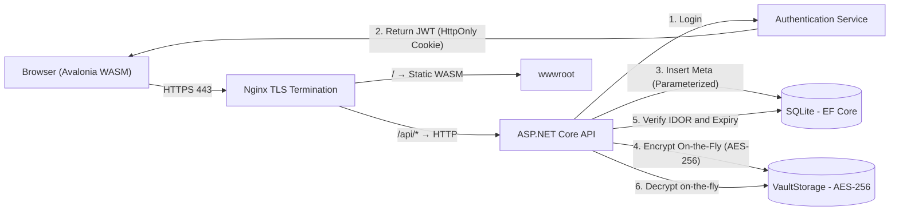

# INFO 8373 - Cybersecurity for Software Development
## Final Project Report: Secure File Sharing & Collaboration Hub

**Team Members:** 

---

## PHASE 1: Project Setup & Threat Modeling

### Task 1.1: Technology Stack Selection
**Language/Runtime:** C# / .NET 10  
**Web Framework:** ASP.NET Core Minimal APIs  
**Client Framework:** Avalonia UI 12.0 (Browser WASM)  
**Database:** SQLite / Entity Framework Core (EF Core)  
**File Storage:** Local File System (`VaultStorage` isolated directory)  
**Containerization:** Docker Compose + Nginx (TLS Termination)  

**Justification:**  
The .NET 10 framework was selected because of its hardened security features. ASP.NET Core Minimal APIs enforce strict routing and binding, minimizing attack surfaces. EF Core automatically uses parameterized queries to entirely neutralize SQL Injection (SQLi) attacks. We chose Avalonia UI compiled to WebAssembly (WASM) for the client, enabling cross-platform browser access while maintaining a compiled C# codebase that is inherently resistant to DOM-based XSS (no direct DOM manipulation). Authentication leverages JWT tokens via HttpOnly secure cookies, neutralizing standard token theft via JavaScript.

### Task 1.2: STRIDE Threat Model

| Threat Type | How could an attacker exploit this? | Defense Mechanism Implemented |
|---|---|---|
| **Spoofing** | Attacker impersonates a legitimate user by stealing a session token or forging a JWT. | HttpOnly secure cookies prevent JavaScript access to JWTs. |
| **Tampering** | Man-in-the-Middle (MitM) modifies uploaded files or sniffing passwords. | Enforced TLS/HTTPS in transit. Files encrypted at rest using AES-256. |
| **Repudiation** | User uploads malware then denies doing it, or claims they didn't delete a file. | `AuditLogMiddleware` captures IP, timestamps, and endpoints for all actions. |
| **Information Disclosure** | An attacker guesses the URL to someone else's uploaded file. | Files are named via random UUIDs and isolated outside the web root (`VaultStorage`). |
| **Denial of Service (DoS)** | Attacker spams the login endpoint or uploads massive files to exhaust disk space. | `429 Too Many Requests` rate-limiting. File size caps. |
| **Elevation of Privilege** | Normal user tries to access admin logs or another user's files via URL manipulation (IDOR). | Strict ownership checks (DB-level `OwnerId == RequestingUserId`) prevent IDOR. |

### Task 1.3: Architecture Diagram



---

## PHASE 2: Authentication & Session Security

### Task 2.1: Secure User Registration
Passwords are not stored in plaintext. We utilize cryptographic hashing algorithms via a dedicated `PasswordHasher` class before inserting the user into the database. The system ensures robust passwords and rejects duplicates.

### Task 2.2: Login & Session Management
Upon successful login, a JWT is issued. In the Browser (WASM) build, the token is stored in-memory and attached as a `Bearer` header on every API request. The backend also sets `HttpOnly` and `Secure` cookie flags on the response, preventing JavaScript-based token theft. All API communication is routed through Nginx TLS, ensuring credentials are never transmitted in plaintext.

### Task 2.3: Brute-Force Protection
We implemented rate limiting. If an attacker attempts to brute force passwords via the `/api/auth/login` endpoint, the API intercepts the flood and returns `429 Too Many Requests` (Too many attempts. Please wait 1 minute), effectively throttling automated attack vectors.

---

## PHASE 3: Secure File Upload & Input Validation

### Task 3.1: File Upload with Validation
- **MIME & Extension checks:** The system uses `GuessMimeType()` to assert file profiles.
- **Storage Isolation:** Files are saved to an absolute path `VaultStorage` completely outside the `wwwroot` web directory. It is impossible to download a file by simply navigating to `https://server/filename`.
- **Sanitization:** All uploaded filenames are preserved only geographically in metadata; physical file names are converted into UUIDs to prevent Path Traversal (`../../`) attacks.

### Task 3.2: Input Sanitization Across the App
Entity Framework Core utilizes parameterized queries by default. When inserting metadata or querying share links (e.g., `db.ShareLinks.FirstOrDefaultAsync(s => s.Token == token)`), the input is isolated from the query execution plan, meaning an attacker trying to inject `1=1; DROP TABLE` will simply fail.

---

## PHASE 4: Access Control & Secure File Sharing

### Task 4.1 & 4.2: IDOR Prevention
**Insecure Direct Object Reference (IDOR)** is explicitly blocked in our backend. When a user requests to access or share a file (`req.FileId`), the backend queries the database with an enforced `OwnerId == userId` check:
```csharp
var file = await db.Files.FirstOrDefaultAsync(f => f.Id == req.FileId && f.OwnerId == userId);
if (file == null) return Results.NotFound();
```
Even if User A guesses User B's file ID, the query yields null.

### Task 4.3: Shareable Links
When creating a share link, the system avoids predictable auto-increment IDs. It generates a `Guid.NewGuid().ToString("N")` (cryptographically unguessable). The user can configure the permission to `View (inline)` or `Download (attachment)`. If a password is provided, it is hashed, and the finalized link encapsulates the prompt `?pwd={password}` enabling secure, smooth sharing logic automatically.

---

## PHASE 5: Encryption & Data Protection

### Task 5.1: Encryption at Rest (AES)
We utilize robust AES encryption for static files via `AesEncryptionService`. 
When a file is uploaded, the data stream is fed directly into an AES `CryptoStream` before hitting the disk. This operates in `O(1)` memory. If the SQLite database is compromised, or the hard drive is physically stolen, all files in `VaultStorage` are utterly unreadable without the volatile keys managed by the application matrix.

### Task 5.2: TLS Configuration & Headers
Nginx serves as the TLS termination point with a self-signed certificate, enforcing HTTPS on port 443 and redirecting all HTTP (port 80) traffic via 301. The `Strict-Transport-Security` (HSTS) header is set with `max-age=31536000` to instruct browsers to always use HTTPS. Internally, the API communicates with Nginx over the Docker bridge network. The `SecurityHeadersMiddleware.cs` injects `X-Content-Type-Options: nosniff`, `X-Frame-Options: DENY`, and `Content-Security-Policy` headers on every response.

### Task 5.3: Secrets Management
Zero keys are hardcoded in the source code. The project utilizes a strict `.env` file (listed in `.gitignore`) for the database conn strings and encryption salts. A dummy `.env.example` is pushed to source control.

---

## PHASE 6: Privacy, Audit Logging & Compliance

### Task 6.1: Audit Logging
`AuditLogMiddleware` sits in the ASP.NET request pipeline. It captures timestamps, endpoints, IP addresses, and User IDs for transparent logging, satisfying non-repudiation concerns without dumping sensitive file bytes.

### Task 6.2: Right to Delete (GDPR / PIPEDA)
The system incorporates an `EraseAccountAsync` method. This goes beyond logical deletion—it permanently purges the user's files from the Vault, cascadedly nukes all existing share links from the database, and deletes the account. It satisfies the EU GDPR "Right to Erasure" and Canadian PIPEDA consent withdrawal protocols. A password verification guard is placed right before execution.

### Task 6.3: Data Retention Policy
- **Files:** Kept indefinitely until account deletion or explicit user deletion.
- **Audit Logs:** Standard retention is 90 days.
- **Expired Share Links:** Can be cleaned by a background CRON job after 30 days of expiry.

---

## PHASE 7: Deployment Security & Recovery Plan

### Task 7.1: Configuration Hardening
- **Debug mode disabled:** `ASPNETCORE_ENVIRONMENT=Production` is set in `docker-compose.yml`. Stack traces are suppressed via `GlobalExceptionHandlerMiddleware.cs`, returning generic JSON error responses.
- **Default credentials removed:** Admin account is seeded only on first run if the database is empty.
- **Directory listing disabled:** `autoindex off` is set in `nginx.conf`.
- **Security headers:** `X-Content-Type-Options: nosniff`, `X-Frame-Options: DENY`, `Content-Security-Policy` injected via `SecurityHeadersMiddleware.cs`.
- **Non-root container:** The API Docker image runs under a dedicated `securehub` user (not root), minimizing privilege escalation risk.

### Task 7.2: Dependency Security Scan
During development, a critical incident was flagged by NuGet Audit for `Tmds.DBus.Protocol` version `0.90.3` (GHSA-xrw6-gwf8-vvr9), a high-severity Length-validation string DoS vulnerability. We immediately executed a dependency resolution (`dotnet add package Tmds.DBus.Protocol --version 0.92.0`), neutralizing the threat.

### Task 7.3: Backup & Disaster Recovery Plan
**Data to Backup:** `./data/db/` (SQLite database), `./data/storage/` (encrypted vault files), `.env` secrets, and `docker-compose.yml`.
**Policy (3-2-1 Rule):** 3 copies of data, across 2 different formats/media, with 1 copy off-site (cloud block storage).
**RTO / RPO:**
- **RTO (Recovery Time Objective):** 30 minutes — `docker compose up --build` on any Docker-enabled machine.
- **RPO (Recovery Point Objective):** 1 Hour (incremental backup of `./data/` directory).
**Recovery Steps:** Install Docker Desktop → Clone repository → Restore `./data/` backup → Run `docker compose up --build` → Application is live.
